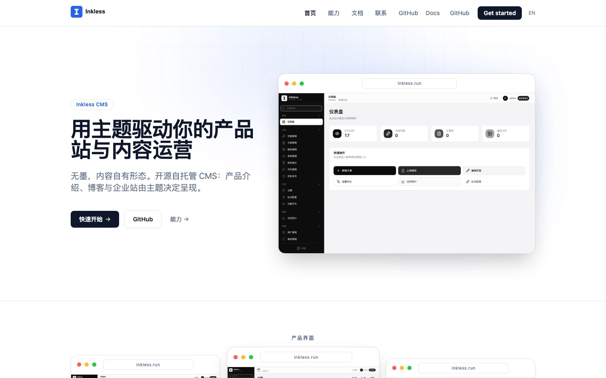
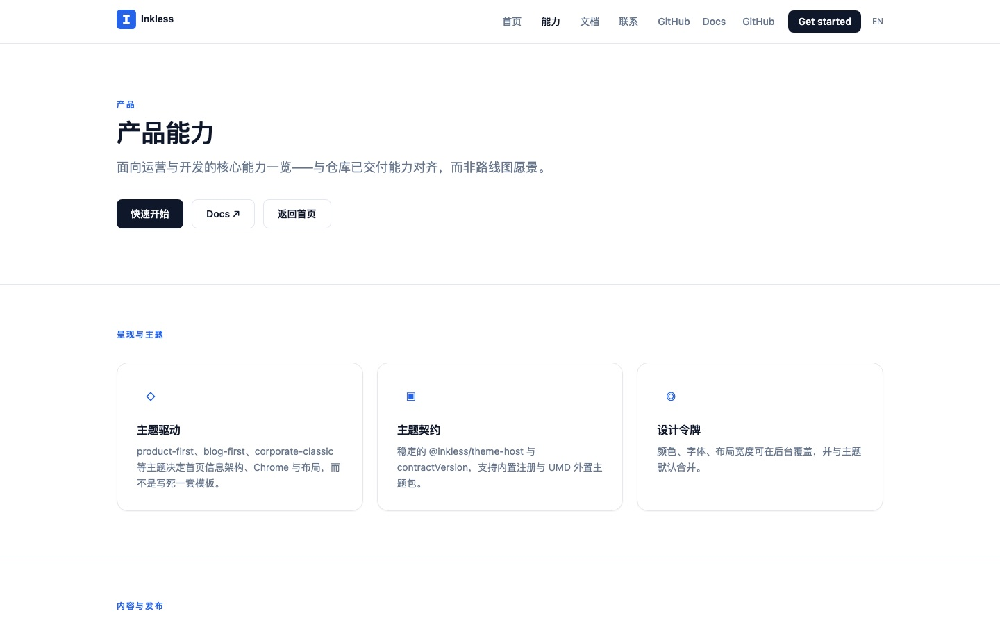
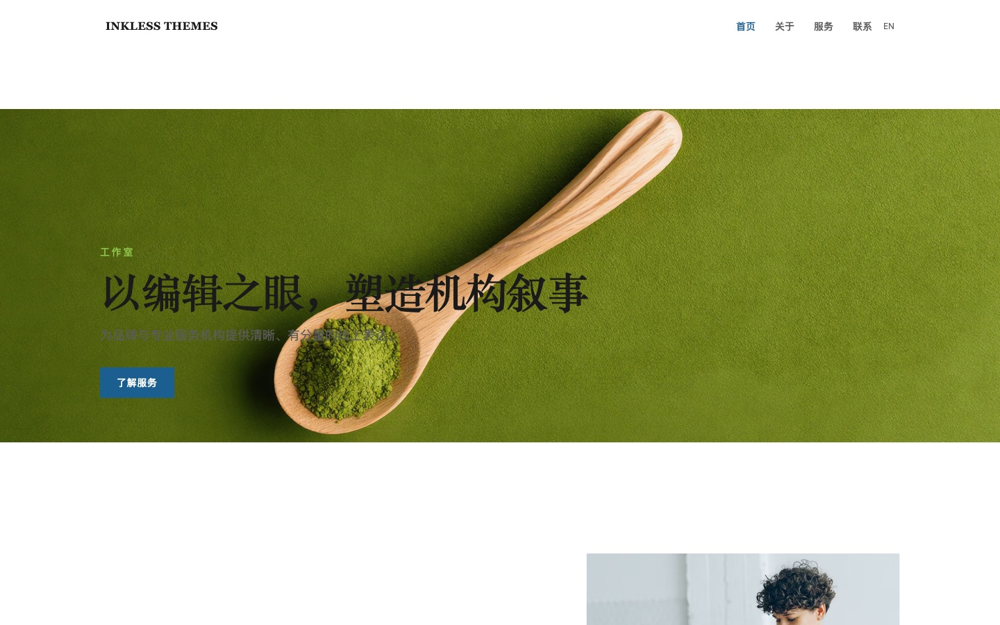
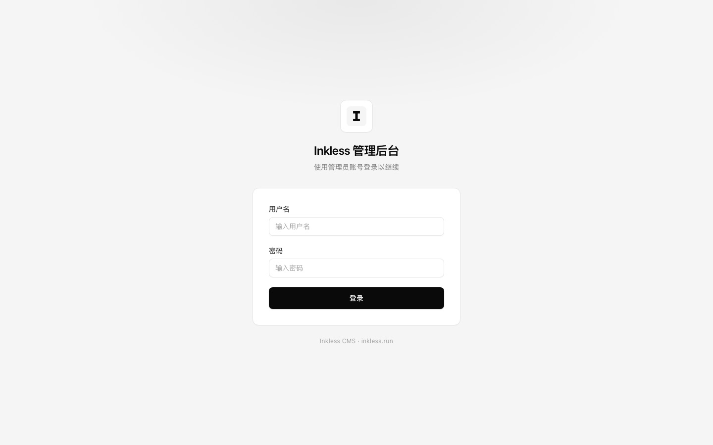

# Inkless CMS

[](https://github.com/yixian-huang/inkless/actions/workflows/quality-gate.yml)
[](LICENSE)
[](backend/go.mod)
[](package.json)

**Self-hosted, bilingual (zh/en) content platform** — Go API + React admin/SPA,
configurable branding, themes, plugins, SQLite or PostgreSQL.

> **Product name:** Inkless CMS · **Website:** [inkless.run](https://inkless.run)  
> Historical names (Impress / 印迹) may appear in older paths and migration notes only.

## Why Inkless

| | |
|--|--|
| **Bilingual by default** | Chinese / English content and UI with locale-aware public pages |
| **Themes** | Pluggable theme packages (contract-versioned host facade) |
| **Extensible** | Event bus, providers (search / storage / notifier / captcha), external plugin runtime (beta) |
| **Self-hosted** | Single binary API, SPA frontend, Docker Compose or versioned artifacts |
| **Operator-friendly** | Web setup wizard, CLI (`inkless`), backups, audit log, RBAC |

Status: **public alpha** (`0.1.0-alpha.x`). APIs and on-disk layout may still change; see [CHANGELOG](CHANGELOG.md).

## Screenshots

From the live product site ([inkless.run](https://inkless.run)) and theme demo
([themes.inkless.run](https://themes.inkless.run)).

<p align="center">
  
</p>

| Marketing site | Theme demo (Editorial Firm) |
|:---:|:---:|
|  |  |

<p align="center">
  
</p>

## Quick start (development)

**Prerequisites:** Go 1.24+, Node.js 22+, pnpm 9+, Make (recommended).

```bash
git clone https://github.com/yixian-huang/inkless.git
cd inkless
make dev-up
```

This installs dependencies, builds the backend (SQLite), and starts:

- API — <http://localhost:8088>
- Frontend — <http://localhost:3000>

Demo seed (local only): open <http://localhost:3000/admin> with `admin` / `admin123`.  
**Never** use default credentials in production.

Stop servers: `make stop`.

### Docker

```bash
cp .env.example .env
docker compose up                 # PostgreSQL + API + frontend
# or
docker compose -f docker-compose.sqlite.yml up
```

### CLI

```bash
cd backend && go build -o inkless ./cmd/inkless
./inkless init
./inkless migrate up
./inkless serve
```

## Documentation

| Audience | Start here |
|----------|------------|
| New contributors | [CONTRIBUTING.md](CONTRIBUTING.md) |
| Architecture | [docs/architecture.md](docs/architecture.md) · [docs/developer-guide.md](docs/developer-guide.md) |
| Deploy / Docker | [docs/deployment.md](docs/deployment.md) · [docs/docker-setup.md](docs/docker-setup.md) |
| Themes / plugins | [docs/theme-contract.md](docs/theme-contract.md) · [docs-site/guide/first-plugin.md](docs-site/guide/first-plugin.md) |
| Docs site (VitePress) | [docs-site/](docs-site/) — `cd docs-site && pnpm install && pnpm dev` |
| Security | [SECURITY.md](SECURITY.md) |
| Public ops summary | [OPS.md](OPS.md) |

Full index: [docs/README.md](docs/README.md).

## Releases

Latest alpha: **[v0.1.0-alpha.2](https://github.com/yixian-huang/inkless/releases/tag/v0.1.0-alpha.2)**
(see [CHANGELOG](CHANGELOG.md)).

Tag pushes build artifacts via
[`.github/workflows/release.yml`](.github/workflows/release.yml):

| Asset | Contents |
|-------|----------|
| `frontend-*.tar.gz` | Static SPA (`out/`) |
| `backend-*.tar.gz` | API binary package |
| `*.sha256` | Checksums |

```bash
# After merging release notes on main:
git tag -a v0.1.0-alpha.2 -m "Inkless v0.1.0-alpha.2"
git push origin v0.1.0-alpha.2
```

Container images on GHCR are planned; until then prefer release assets or build
from source with `./scripts/build-frontend.sh` and `./scripts/build-backend.sh`.

## Project layout

```text
frontend/     Vite + React SPA (admin + public)
backend/      Go/Gin API, CLI, plugins SDK
docs/         Specs and guides (see docs/README.md)
docs-site/    VitePress user-facing docs
packages/     Theme packages
scripts/      Build, deploy helpers, smoke tests
ops/          systemd unit template, example configs
```

## Contributing

1. Read [CONTRIBUTING.md](CONTRIBUTING.md) and the [Code of Conduct](CODE_OF_CONDUCT.md).  
2. Open an issue for larger changes.  
3. Run `pnpm lint && pnpm type-check && pnpm test` and `cd backend && go test -race ./...`.  
4. Submit a PR against `main` (CI quality gate must pass).  

Security issues: see [SECURITY.md](SECURITY.md) — **do not** file public issues for vulnerabilities.

## Community

- Website: <https://inkless.run>
- Source: <https://github.com/yixian-huang/inkless>
- Issues: <https://github.com/yixian-huang/inkless/issues>

## License

[MIT](LICENSE) © Inkless CMS contributors
