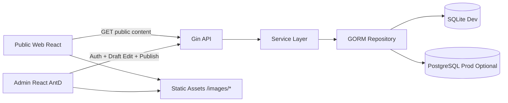
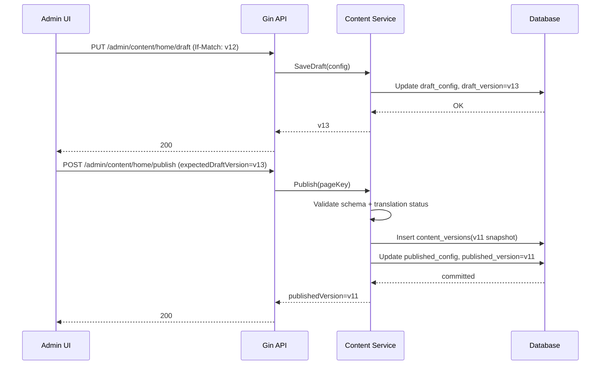
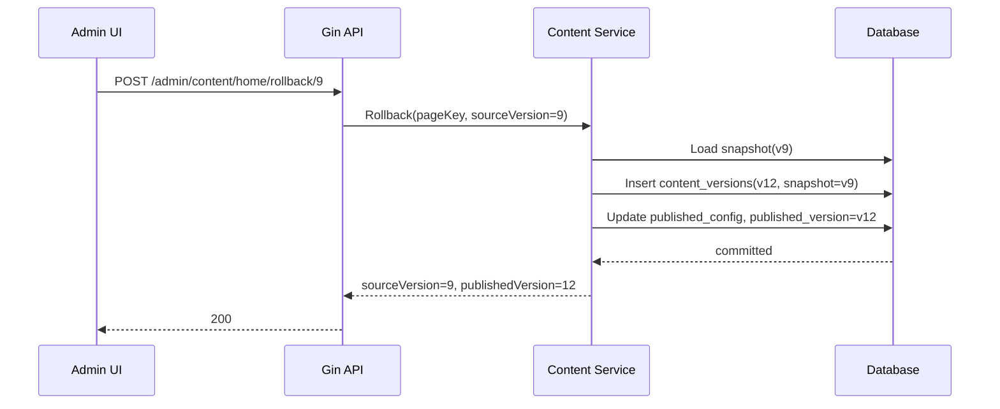

# 架构设计与技术栈说明

## 1. 技术栈

- 前台站点：React + React Router + Tailwind（保留现有实现）
- 管理后台：React + React Router + Ant Design
- 后端：Go + Gin + GORM
- 数据库：SQLite（开发）/ PostgreSQL（生产可选）
- 认证：JWT（Access Token + Refresh Token）

## 2. 分层架构

- `Handler`：参数校验、鉴权、HTTP 响应
- `Service`：发布规则、翻译状态计算、版本控制
- `Repository`：GORM 数据访问
- `DB`：`content_documents`、`content_versions`、`users`、`refresh_tokens`

## 2.1 实例与站点边界

Impress 的当前架构是“一个实例服务一个逻辑站点”，不是共享数据库多租户平台。

- `BASE_URL` 是实例唯一的 canonical origin。Sitemap、RSS、canonical 和对外 URL 均以它为准。
- 同一站点的其它域名是部署层别名，默认由反向代理 301 到 `BASE_URL`。
- 多个独立站点运行多个 Impress 实例；各实例隔离数据库、上传、插件、备份、JWT secret 和后台会话。
- 核心内容模型不包含租户 `site_id`，Repository 不注入站点 Scope。
- `SiteConfig` 是当前实例的全局配置，必须保留；它不是多租户 `Site`。
- 历史 `sites`、`site_users` 和角色表中的 `site_id` 在当前兼容窗口只停止使用，不自动 DROP。

详细决策与后果见 [ADR-0001：单实例单逻辑站点](adr/0001-single-instance-single-site.md)。

## 3. 发布链路（同步发布 zh/en）

## 4. 回滚链路（生成新版本）

## 5. 数据与权限边界

- 公共读：仅 `published_config`
- 后台写：仅 `draft_config`
- 发布与回滚：仅 `admin`
- 编辑与校验：`admin` + `editor`
- 审计信息：`changeNote`、`operator`、`createdAt`

## 6. 环境策略

- 开发环境：SQLite，快速启动与本地联调
- 生产环境：PostgreSQL（可选），优先 `JSONB`、事务能力更强
- 静态资源：继续走前端静态目录/CDN，配置中保存 URL，不在本期引入对象存储签名上传

## 7. 与现有前端的衔接

- 第一阶段：
  - 前台按 `PublicPageResponse.config` 渲染
  - `react-i18next` 保留为兼容兜底
- 第二阶段：
  - 逐页移除分散 i18n key 依赖
  - 将页面渲染完全切到配置驱动

## 8. 验收与可观测性

- 验收目标：所有现有页面内容可在后台编辑并发布，支持版本回滚
- 核心指标：
  - 发布成功率
  - 校验失败率（missing/stale）
  - 回滚平均耗时
  - 公共接口 P95 延迟
