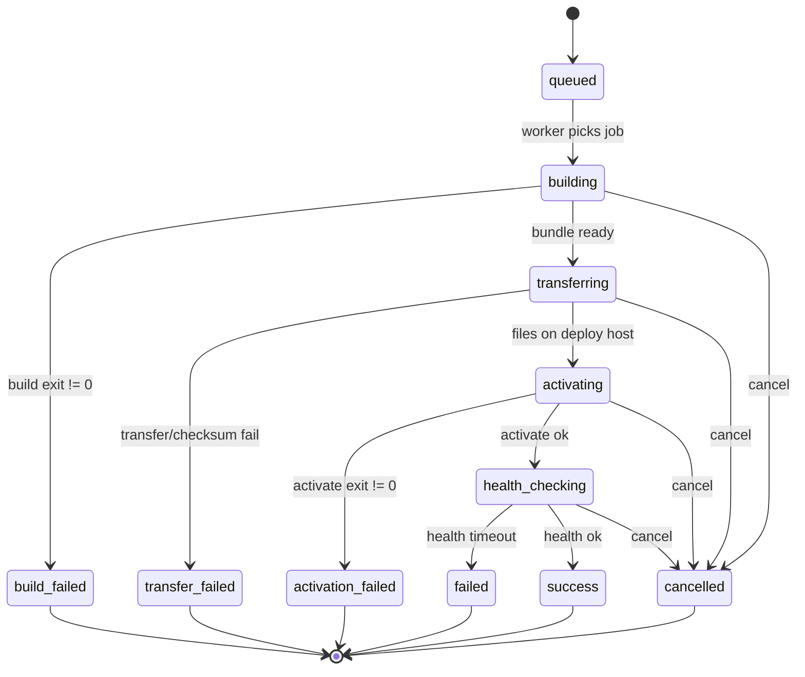

# Quick-Box `artifact` deployMethod — 需求说明（草案）

**Status:** Draft for QB team review  
**Author:** impress project  
**Date:** 2026-06-14  
**Reference consumer:** [impress](https://github.com/yixian-huang/impress.git) (`scripts/build-*.sh`, `scripts/deploy.sh`, `scripts/rollback.sh`)

---

## 1. 背景与动机

### 1.1 现状

Quick-Box 当前 `deployMethod` 仅支持：

| 方法 | 构建产物 | 分发机制 | 典型耗时 |
|------|----------|----------|----------|
| `docker` | Docker 镜像 | `docker save \| load`（`distribution: transfer`） | 多阶段 build 常 20–40+ 分钟 |
| `script` | 由仓库脚本决定 | 无标准 artifact 层 | 取决于脚本实现 |

impress 在 `hk`（`82.158.226.66`）上的多次部署失败/超时，根因包括：

- 构建与部署同机，在目标 VPS 上跑 `pnpm build` + `CGO go build` + `docker build`
- 构建阶段日志稀疏、心跳停滞，平台难以区分「慢」与「死」
- 小内存机器上 Docker 构建与宿主机其他服务争抢资源

### 1.2 impress 已有、但未接入 QB 的能力

仓库内已具备**版本化 artifact** 流水线（与 Docker 并行存在）：

```
scripts/build-backend.sh   → artifacts/backend-{version}.tar.gz
scripts/build-frontend.sh  → artifacts/frontend-{version}.tar.gz
scripts/deploy.sh          → SSH 上传 + 版本目录 + systemd 切换
scripts/rollback.sh        → symlink 回滚
scripts/deploy-http.sh     → HTTP multipart 上传 artifact（可选接收端）
```

这些脚本定义了**可移植的构建产物契约**，但 Quick-Box 无法原生调度「构建机打 tar → 传到部署机 → 激活」。

### 1.3 目标

新增 **`deployMethod: artifact`**，使 Quick-Box 能：

1. 在 **build server** 上按仓库约定构建 artifact（无需 Docker）
2. 通过 **transfer** 将 artifact 分发到一台或多台 deploy server
3. 在 deploy server 上执行仓库约定的 **activate** 步骤（systemd / 进程替换 / 软链切换）
4. 提供与 `docker` 同等粒度的**状态机、日志、心跳、健康检查、取消、AI handoff**

### 1.4 非目标（Phase 1）

- 不替代 `docker` / `script`，三者并存
- 不要求 QB 托管通用 CI（GitHub Actions 仍可预构建后触发 deploy-only）
- 不强制所有项目使用相同打包格式（通过 `artifactManifest` 扩展）
- Phase 1 不要求 UI 可视化 artifact 浏览器（API 足够）

---

## 2. 核心概念

```text
┌─────────────┐   build      ┌──────────────────┐   transfer    ┌─────────────┐
│ buildServer │ ──────────► │ artifact bundle  │ ────────────► │ deployServer │
│ (git clone) │  repo hooks │ (tar + metadata) │  scp/rsync    │ (activate)   │
└─────────────┘              └──────────────────┘               └─────────────┘
```

| 术语 | 含义 |
|------|------|
| **Artifact bundle** | 一次部署的版本化文件集合 + `artifact-manifest.json` |
| **Build phase** | 在 build server 执行 `buildCommand`，产出 bundle |
| **Transfer phase** | 将 bundle 传到 deploy server 的 `stagingPath` |
| **Activate phase** | 在 deploy server 执行 `activateCommand`，切换运行版本 |
| **Health gate** | `healthCheckUrl` 通过后才标记 `success` |

---

## 3. API 设计

### 3.1 `POST /onboarding/init-project` 扩展

在现有 body 上增加 `deployMethod: "artifact"` 与 `artifactDeployConfig`：

```json
{
  "repoUrl": "https://github.com/yixian-huang/impress.git",
  "environmentName": "hk",
  "deployMethod": "artifact",

  "buildServerName": "qb-build-01",
  "deployServerNames": ["VIP Cloud - 82.158.226.66"],

  "workDir": "/home/impress",
  "gitRef": "main",

  "artifactDeployConfig": {
    "manifestPath": "ops/artifact-manifest.json",
    "buildCommand": "bash ./scripts/qb-artifact-build.sh",
    "activateCommand": "bash ./scripts/qb-artifact-activate.sh",
    "rollbackCommand": "bash ./scripts/qb-artifact-rollback.sh",

    "bundle": {
      "format": "tar.gz",
      "includePatterns": [
        "artifacts/backend-*.tar.gz",
        "artifacts/frontend-*.tar.gz",
        "artifacts/build-info.json"
      ],
      "manifestFile": "artifact-manifest.json"
    },

    "stagingPath": "/var/lib/quickbox/staging/{deploymentId}",
    "releaseRoot": "/opt/impress",
    "versionLayout": "semver-directory",

    "runtime": {
      "type": "systemd",
      "unitName": "impress",
      "user": "impress"
    },

    "healthCheckUrl": "http://127.0.0.1:8088/health",
    "healthCheckGraceSec": 30,
    "healthCheckRetries": 10,
    "healthCheckIntervalSec": 3
  },

  "distribution": "transfer",
  "distributionConfig": {
    "transport": "scp",
    "targetPath": "/var/lib/quickbox/incoming",
    "checksum": "sha256",
    "parallelism": 1
  },

  "deployTimeout": 1800,
  "envVars": {
    "PORT": { "value": "8088" },
    "FRONTEND_DIR": { "value": "/opt/impress/frontend/current" },
    "DB_DSN": { "value": "file:/opt/impress/data/impress.db?cache=shared&mode=rwc", "isSecret": false },
    "JWT_SECRET": { "value": "...", "isSecret": true }
  }
}
```

### 3.2 `artifactDeployConfig` 字段说明

| 字段 | 类型 | 必填 | 说明 |
|------|------|------|------|
| `manifestPath` | string | 否 | 仓库内静态 manifest 路径；与动态 `buildCommand` 二选一或合并 |
| `buildCommand` | string | **是** | 在 build server `workDir` 执行的构建命令 |
| `activateCommand` | string | **是** | 在 deploy server 激活命令；QB 注入环境变量（见 §5） |
| `rollbackCommand` | string | 否 | 失败或人工回滚时执行 |
| `bundle.format` | enum | **是** | `tar.gz` \| `tar.zst` \| `directory` |
| `bundle.includePatterns` | string[] | 否 | glob；默认整个 staging 目录 |
| `bundle.manifestFile` | string | 否 | 默认 `artifact-manifest.json` |
| `stagingPath` | string | **是** | 部署机暂存路径；支持 `{deploymentId}` `{version}` 模板 |
| `releaseRoot` | string | **是** | 应用安装根目录 |
| `versionLayout` | enum | 否 | `semver-directory` \| `flat` \| `symlink-current` |
| `runtime.type` | enum | 否 | `systemd` \| `process` \| `none`（仅文件切换） |
| `runtime.unitName` | string | 条件 | `systemd` 时必填 |
| `runtime.user` | string | 否 | 运行用户 |
| `healthCheckUrl` | string | **是** | 部署机本地 URL |
| `healthCheckGraceSec` | int | 否 | 激活后等待再探测 |
| `healthCheckRetries` | int | 否 | 默认 10 |
| `healthCheckIntervalSec` | int | 否 | 默认 3 |

### 3.3 `PATCH /projects/:pid/environments/:eid`

允许 API Key 受限更新（与现有 docker 环境对齐）：

```json
{
  "deployMethod": "artifact",
  "artifactDeployConfig": { "...": "..." },
  "distribution": "transfer",
  "buildServerId": "uuid",
  "deployTimeout": 1800,
  "healthCheckUrl": "http://127.0.0.1:8088/health"
}
```

### 3.4 `POST /deploy-hooks/:projectId/:envName`

请求体扩展（向后兼容）：

```json
{
  "gitRef": "main",
  "gitCommitSha": "optional-40-char-sha",
  "deployMode": "full",
  "artifactOptions": {
    "components": ["backend", "frontend"],
    "skipBuild": false,
    "version": "v1.2.3"
  }
}
```

| `deployMode` | 行为 |
|--------------|------|
| `full` | build + transfer + activate（默认） |
| `build-only` | 仅构建并登记 artifact，不分发 |
| `deploy-only` | 使用已有 artifact（需 `artifactOptions.version` 或 `bundleId`） |
| `activate-only` | 跳过 build/transfer，仅重跑 activate（排障用） |

响应（与现有一致，增加 artifact 字段）：

```json
{
  "data": {
    "id": "deployment-uuid",
    "status": "queued",
    "deployMethod": "artifact",
    "gitRef": "main",
    "gitCommitSha": "abc123...",
    "artifactBundleId": null
  }
}
```

### 3.5 `GET /deployments/:id` 响应扩展

```json
{
  "data": {
    "id": "...",
    "status": "activating",
    "currentPhase": "activate",
    "progress": 75,
    "lastHeartbeatAt": "2026-06-14T12:00:00Z",
    "lastLogAt": "2026-06-14T12:00:01Z",
    "healthCheckPassed": false,

    "artifact": {
      "version": "v1.2.3-abc1234",
      "bundleId": "art_...",
      "bundleSizeBytes": 45678901,
      "bundleSha256": "…",
      "components": [
        { "name": "backend", "path": "artifacts/backend-v1.2.3.tar.gz", "sha256": "…" },
        { "name": "frontend", "path": "artifacts/frontend-v1.2.3.tar.gz", "sha256": "…" }
      ],
      "buildServerId": "...",
      "buildDurationSec": 312,
      "transferDurationSec": 45,
      "activateDurationSec": 8
    },

    "blockers": [],
    "recommendedAction": null
  }
}
```

### 3.6 `GET /deployments/:id/logs`

日志条目增加 `phase` 与结构化 `metadata`：

```json
{
  "timestamp": "…",
  "level": "info",
  "phase": "build",
  "message": "build step completed",
  "metadata": {
    "step": "build-backend",
    "exitCode": 0,
    "durationSec": 120,
    "text": "…stdout tail…"
  }
}
```

### 3.7 `POST /deployments/:id/cancel`

行为要求：

1. API 状态 → `cancelled`
2. 向 build server / deploy server 发送终止信号（`SIGTERM`，超时 `SIGKILL`）
3. 日志写入 `remote process terminated`
4. 清理 `stagingPath` 中**未激活**的半成品（可选配置 `cleanupOnCancel: true`）

### 3.8 `POST /deployments/:id/rollback`

```json
{ "target": "previous", "components": ["backend", "frontend"] }
```

执行环境配置的 `rollbackCommand`，状态机见 §4.3。

### 3.9 Artifact 存储（可选 Phase 1.5）

```
GET  /projects/:pid/artifacts?limit=20
GET  /projects/:pid/artifacts/:bundleId
POST /projects/:pid/artifacts/:bundleId/promote  → 触发 deploy-only
```

用于「CI 构建 → QB 只分发」模式；Phase 1 可仅用 deployment 附带的 bundle，不持久化到全局 artifact registry。

---

## 4. 状态机

### 4.1 主部署状态



### 4.2 `status` 与 `currentPhase` 对照

| `status` | `currentPhase` | `progress` 建议 | 说明 |
|----------|----------------|-----------------|------|
| `queued` | `queue` | 0 | 等待 worker |
| `building` | `build` | 10–40 | 执行 `buildCommand` |
| `build_failed` | `build` | 40 | 构建失败终态 |
| `transferring` | `transfer` | 45–65 | scp/rsync + checksum |
| `transfer_failed` | `transfer` | 65 | 传输失败终态 |
| `activating` | `activate` | 70–85 | `activateCommand` + runtime reload |
| `activation_failed` | `activate` | 85 | 激活失败终态 |
| `health_checking` | `healthcheck` | 90–99 | 探测 `healthCheckUrl` |
| `success` | `done` | 100 | **`healthCheckPassed: true` 必填** |
| `failed` | `healthcheck` | 99 | 健康检查超时 |
| `cancelled` | `cancelled` | * | 用户/系统取消 |
| `timed_out` | * | * | 超过 `deployTimeout` 或心跳失联 |

### 4.3 心跳与僵死检测（P0，吸取 impress 部署教训）

| 规则 | 默认值 |
|------|--------|
| `lastHeartbeatAt` 超过 **5 分钟**未更新且 `status` 非 terminal | 标记 `stale`，写入 `blockers: ["heartbeat_stale"]` |
| `lastLogAt` 超过 **15 分钟**无新日志且 phase 为 `build` | 标记 `stale`，`recommendedAction: "cancel_and_redeploy"` |
| 超过 `deployTimeout` | 自动 `timed_out` 并 kill 远端进程 |
| `progress` 在同一 phase 停滞超过 **10 分钟** | 写入 warning 日志（不自动失败） |

**完成判定（AI handoff 强制）：**

```text
success 仅当: status == "success" AND healthCheckPassed == true
```

### 4.4 回滚状态（简化）

```text
rollback_queued → rollback_activating → rollback_health_checking → rollback_success | rollback_failed
```

---

## 5. quickboxd 执行契约（注入环境变量）

### 5.1 Build server 环境

在执行 `buildCommand` 前，quickboxd 应 export：

```bash
QB_DEPLOYMENT_ID=...
QB_PROJECT_ID=...
QB_ENVIRONMENT_NAME=hk
QB_GIT_REF=main
QB_GIT_COMMIT_SHA=abc123...
QB_WORKDIR=/home/impress
QB_ARTIFACT_STAGING=/tmp/qb-artifacts/{deploymentId}
QB_VERSION=v1.2.3-abc1234          # 平台生成或来自 git describe
QB_BUILD_COMPONENTS=backend,frontend  # 来自 artifactOptions
```

构建命令结束后，quickboxd 读取：

```
$QB_ARTIFACT_STAGING/artifact-manifest.json
```

若缺失或 `bundleSha256` 校验失败 → `build_failed`。

### 5.2 Deploy server 环境（activate）

```bash
QB_DEPLOYMENT_ID=...
QB_VERSION=...
QB_ARTIFACT_INCOMING=/var/lib/quickbox/incoming/{deploymentId}
QB_RELEASE_ROOT=/opt/impress
QB_STAGING_PATH=/var/lib/quickbox/staging/{deploymentId}
QB_PREVIOUS_VERSION=...             # 若存在 current 软链
QB_RUNTIME_TYPE=systemd
QB_SYSTEMD_UNIT=impress

# 应用 env（来自 QB 环境变量，secret 已解密）
PORT=8088
DB_DSN=...
JWT_SECRET=...
JWT_REFRESH_SECRET=...
FRONTEND_DIR=/opt/impress/frontend/current
UPLOAD_DIR=/opt/impress/uploads
BACKUP_DIR=/opt/impress/backups
BASE_URL=https://www.example.com
CORS_ALLOWED_ORIGINS=https://www.example.com,https://admin.example.com
PLUGIN_DIR=/opt/impress/plugins
PLUGIN_DATA_DIR=/opt/impress/data/plugins
ENABLE_EXTERNAL_PLUGINS=false
```

`qb_write_env_file` 会把上述运行参数写入每个实例自己的
`${QB_RELEASE_ROOT}/backend/.env`。解析优先级是：本次 activate/rollback
显式传入的环境变量、已有 `.env`、脚本默认值。`BASE_URL` 是唯一 canonical
origin；`CORS_ALLOWED_ORIGINS` 是允许访问后台 API 的完整 origin 列表，不应填写
只有 hostname 的值。未显式传入时，脚本使用与实例端口绑定的本机 URL，并把备份、
插件包和插件数据分别放在 `${QB_RELEASE_ROOT}/backups`、
`${QB_RELEASE_ROOT}/plugins` 与 `${QB_RELEASE_ROOT}/data/plugins`。

### 5.3 Transfer

| `distributionConfig.transport` | 行为 |
|-------------------------------|------|
| `scp` | build server → deploy server，默认 |
| `rsync` | 大 artifact 增量同步 |
| `local` | build server 与 deploy server 同机，跳过网络传输 |

传输后必须在 deploy server 校验 `artifact-manifest.json` 中每个 component 的 `sha256`。

---

## 6. 仓库侧约定：`ops/artifact-manifest.json`（静态模板）

QB 与仓库共同识别的 manifest  schema：

```json
{
  "schemaVersion": 1,
  "project": "impress",
  "components": [
    {
      "name": "backend",
      "buildScript": "scripts/build-backend.sh",
      "artifactPattern": "artifacts/backend-{version}.tar.gz",
      "checksumPattern": "artifacts/backend-{version}.tar.gz.sha256",
      "deployPath": "backend/versions/{version}",
      "runtime": {
        "binaryName": "blotting-api-{version}",
        "symlink": "backend/current/blotting-api-latest"
      }
    },
    {
      "name": "frontend",
      "buildScript": "scripts/build-frontend.sh",
      "artifactPattern": "artifacts/frontend-{version}.tar.gz",
      "checksumPattern": "artifacts/frontend-{version}.tar.gz.sha256",
      "deployPath": "frontend/versions/{version}",
      "symlink": "frontend/current"
    }
  ],
  "sharedMetadata": "artifacts/build-info.json",
  "healthCheckPath": "/health"
}
```

构建完成后生成的 **`artifact-manifest.json`（动态实例）**：

```json
{
  "schemaVersion": 1,
  "version": "v1.2.3-abc1234",
  "gitCommitSha": "abc1234567890abcdef1234567890abcdef123456",
  "builtAt": "2026-06-14T12:00:00Z",
  "bundleSha256": "…",
  "components": [
    {
      "name": "backend",
      "path": "artifacts/backend-v1.2.3-abc1234.tar.gz",
      "sha256": "…",
      "sizeBytes": 23456789
    },
    {
      "name": "frontend",
      "path": "artifacts/frontend-v1.2.3-abc1234.tar.gz",
      "sha256": "…",
      "sizeBytes": 12345678
    }
  ]
}
```

---

## 7. impress `scripts/` 对接约定（参考实现）

QB team 可将下列脚本作为 **conformance test** 的消费者；impress 侧在 artifact 支持落地后新增。

### 7.1 `scripts/qb-artifact-build.sh`（build server）

```bash
#!/usr/bin/env bash
set -euo pipefail
# 输入: QB_VERSION, QB_ARTIFACT_STAGING, QB_WORKDIR
cd "${QB_WORKDIR:-.}"
export VERSION="${QB_VERSION}"
./scripts/build-backend.sh
./scripts/build-frontend.sh
mkdir -p "${QB_ARTIFACT_STAGING}"
cp artifacts/backend-${VERSION}.tar.gz artifacts/frontend-${VERSION}.tar.gz \
   artifacts/build-info.json "${QB_ARTIFACT_STAGING}/"
# 生成动态 manifest（可用 scripts/qb-artifact-manifest.sh）
./scripts/qb-artifact-manifest.sh > "${QB_ARTIFACT_STAGING}/artifact-manifest.json"
```

### 7.2 `scripts/qb-artifact-activate.sh`（deploy server）

职责对齐现有 `scripts/deploy.sh`：

1. 校验 `${QB_ARTIFACT_INCOMING}` 内 checksum
2. 解压到 `${QB_RELEASE_ROOT}/{backend,frontend}/versions/${QB_VERSION}/`
3. 原子切换 `current` / `blotting-api-latest` 软链
4. `systemctl restart ${QB_SYSTEMD_UNIT}` 或 `process` 模式 reload
5. 失败时调用 `rollbackCommand` 或保留 previous 软链自动回滚

目录布局（与 `docs/deployment.md` 一致）：

```text
/opt/impress/
├── backend/
│   ├── versions/{version}/
│   ├── current -> versions/{version}
│   └── previous -> versions/{prev}
├── frontend/
│   ├── versions/{version}/
│   └── current -> versions/{version}
├── data/
└── uploads/
```

### 7.3 `scripts/qb-artifact-rollback.sh`

包装 `scripts/rollback.sh`：

```bash
COMPONENT=all TARGET_VERSION=previous ./scripts/rollback.sh
```

### 7.4 与现有脚本映射

| 现有脚本 | artifact 模式角色 |
|----------|-------------------|
| `build-backend.sh` | backend component 构建 |
| `build-frontend.sh` | frontend component 构建 |
| `deploy.sh` | activate 逻辑参考实现 |
| `rollback.sh` | rollback 逻辑参考实现 |
| `deploy-http.sh` | 可选：CI 上传到 QB artifact registry |
| `qb-docker-deploy.sh` | **不被 artifact 替代**；docker 路径保留 |

### 7.5 impress 一体化运行时（无 Nginx 分离）

与 Docker 模式一致，单进程托管 SPA：

```bash
FRONTEND_DIR=/opt/impress/frontend/current
UPLOAD_DIR=/opt/impress/uploads
PORT=8088
```

`activate` 后二进制从 `/opt/impress/backend/current/blotting-api-latest` 启动（或 systemd `ExecStart` 指向该路径）。

### 7.6 同一主机运行两个独立实例

每个逻辑站点使用独立的 Quick-Box project/environment 配置。以下示例中的所有实例
边界都必须唯一；两个实例不得共用数据库、上传目录、插件目录、插件数据目录、JWT
secret 或后台会话：

| 参数 | 实例 A | 实例 B |
| --- | --- | --- |
| `QB_RELEASE_ROOT` | `/opt/impress-a` | `/opt/impress-b` |
| `QB_SYSTEMD_UNIT` | `impress-a` | `impress-b` |
| `PORT` | `8088` | `8089` |
| `DB_DSN` | `file:/opt/impress-a/data/impress.db?cache=shared&mode=rwc` | `file:/opt/impress-b/data/impress.db?cache=shared&mode=rwc` |
| `UPLOAD_DIR` | `/opt/impress-a/uploads` | `/opt/impress-b/uploads` |
| `BACKUP_DIR` | `/opt/impress-a/backups` | `/opt/impress-b/backups` |
| `PLUGIN_DIR` | `/opt/impress-a/plugins` | `/opt/impress-b/plugins` |
| `PLUGIN_DATA_DIR` | `/opt/impress-a/data/plugins` | `/opt/impress-b/data/plugins` |
| `BASE_URL` | `https://a.example.com` | `https://b.example.com` |
| `JWT_SECRET` / `JWT_REFRESH_SECRET` | 独立 secret A | 独立 secret B |

两个 systemd unit 可使用同一模板，但 `WorkingDirectory`、`EnvironmentFile` 和
`ExecStart` 必须分别指向 `/opt/impress-a` 与 `/opt/impress-b`；在
`ProtectSystem=strict` 下，`ReadWritePaths` 还必须放行各自的备份、插件包和插件数据目录。
activate 脚本会在 `${QB_SYSTEMD_UNIT}.service.d/impress-instance-paths.conf` 写入对应
drop-in。升级、回滚或停止某一实例时，只操作对应的 `QB_RELEASE_ROOT` 与
`QB_SYSTEMD_UNIT`。

Nginx 按主域转发；同一实例的域名别名默认 301 到 `BASE_URL`，保留 path 与 query：

```nginx
server {
    listen 443 ssl;
    server_name a.example.com;
    location / {
        proxy_pass http://127.0.0.1:8088;
        proxy_set_header Host $host;
        proxy_set_header X-Forwarded-Proto $scheme;
        proxy_set_header X-Forwarded-For $proxy_add_x_forwarded_for;
    }
}

server {
    listen 443 ssl;
    server_name alias-a.example.net;
    return 301 https://a.example.com$request_uri;
}

server {
    listen 443 ssl;
    server_name b.example.com;
    location / {
        proxy_pass http://127.0.0.1:8089;
        proxy_set_header Host $host;
        proxy_set_header X-Forwarded-Proto $scheme;
        proxy_set_header X-Forwarded-For $proxy_add_x_forwarded_for;
    }
}
```

Caddy 等价配置：

```caddyfile
a.example.com {
    reverse_proxy 127.0.0.1:8088
}

alias-a.example.net {
    redir https://a.example.com{uri} permanent
}

b.example.com {
    reverse_proxy 127.0.0.1:8089
}
```

如果业务要求别名不跳转，应用仍会基于 `BASE_URL` 输出主域 canonical；此模式必须另行
确认缓存键、Cookie domain 和搜索引擎重复内容风险。

本地或 CI 可运行不依赖生产凭据的隔离验证：

```bash
./scripts/test-qb-artifact-env.sh
./scripts/smoke-two-instances.sh
```

第二个脚本构建一个临时后端二进制，同时启动 A/B，验证独立端口、SQLite 数据库、上传
目录、插件数据、相同 slug 的不同文章、A 的数据库备份，以及停止/重启任一实例不影响
另一个实例。端口被占用时可设置 `IMPRESS_SMOKE_PORT_A`、`IMPRESS_SMOKE_PORT_B`；传入
`IMPRESS_SMOKE_BINARY` 可复用已构建的 server 二进制。

---

## 8. AI handoff 扩展

`GET /projects/:id/ai-handoff?format=json` 增加：

```json
{
  "deploymentCapabilities": {
    "supportedMethods": ["docker", "script", "artifact"],
    "hk": {
      "deployMethod": "artifact",
      "buildServer": { "id": "...", "name": "qb-build-01", "host": "..." },
      "deployServers": [{ "id": "...", "host": "82.158.226.66" }],
      "serviceReachable": false,
      "lastDeployment": {
        "id": "...",
        "status": "build_failed",
        "currentPhase": "build",
        "healthCheckPassed": false,
        "artifact": { "version": "v1.2.3", "bundleSha256": "…" }
      },
      "blockers": ["port_8088_not_listening"],
      "recommendedAction": "fix_build_then_redeploy"
    }
  }
}
```

`GET /onboarding/conventions` 增加 **Artifact conventions** 章节，说明 manifest schema、必需脚本、完成判定。

---

## 9. 安全与权限

| 项 | 要求 |
|----|------|
| Secret 注入 | 仅在 activate 阶段的子进程环境中解密；不得写入 artifact |
| API Key `execute` | 白名单只读 playbook：`inspect_artifact_staging`, `inspect_systemd_unit` |
| Artifact 完整性 | 传输后必须校验 sha256；支持可选 GPG/signify 签名（Phase 2） |
| 路径穿越 | `activateCommand` 仅允许在 `releaseRoot` 下写操作 |
| 多租户 | `stagingPath` / `releaseRoot` 按 project 隔离 |

---

## 10. 与 `docker` / `script` 的选型指引

| 场景 | 推荐 |
|------|------|
| 需要容器隔离、依赖复杂 | `docker` |
| 仓库已有成熟 deploy 脚本、快速试验 | `script` |
| Go/Node 单体或前后端 tarball、systemd、低内存 VPS | **`artifact`** |
| CI 已构建好 tarball，VPS 只接收 | `artifact` + `deployMode: deploy-only` |
| impress `hk` 生产 | **`artifact`**（build server 编译 → hk 仅激活，避免现场 docker build） |

---

## 11. 验收标准（以 impress 为 golden path）

1. **init-project** 创建 `deployMethod: artifact` 环境，`buildServer` ≠ `deployServer`
2. `POST deploy-hooks/.../hk` 触发后，状态按 §4 流转，日志含 `build` / `transfer` / `activate` / `healthcheck` 四阶段
3. build 阶段在 build server 完成，**deploy server 无 node/go 编译器亦可部署**
4. 传输后 checksum 校验失败 → `transfer_failed`，不执行 activate
5. activate 后 `curl http://82.158.226.66:8088/health` 返回 `healthy`，且 `healthCheckPassed: true`
6. `cancel` 后远端 build/activate 进程终止，日志可见 `remote process terminated`
7. 心跳失联 5 分钟 → `stale` 标记 + `recommendedAction`
8. `rollback` 后服务恢复上一版本且 health 通过；仓库的双实例 smoke 还会验证 A 的
   真实备份/恢复与 release 软链升级/回滚期间 B 持续健康且内容不变
9. AI 仅通过 API Key 完成：handoff → deploy → poll → health 验证，无需 SSH

---

## 12. 分阶段交付建议（QB team）

| Phase | 范围 |
|-------|------|
| **P0** | `artifact` deployMethod、transfer(scp)、状态机、health gate、cancel、manifest 校验 |
| **P1** | `deployMode` 变体、`rollback` API、stale 检测、handoff 扩展 |
| **P2** | artifact registry、rsync、签名、多 deploy server 滚动激活 |
| **P3** | UI artifact 列表、diff 版本、一键 promote |

---

## 13. 开放问题（待 QB team 确认）

1. **同机 build+deploy**：`distribution: local` 是否跳过 transfer 阶段但保留独立 phase 日志？
2. **部分组件部署**：`artifactOptions.components: ["backend"]` 是否跳过 frontend build？
3. **CGO 交叉编译**：build server OS/ARCH 与 deploy server 不一致时，是否强制 manifest 声明 `targetPlatform`？
4. **并发部署**：同一环境排队策略 vs 强制 cancel 前一个 `running`？
5. **磁盘配额**：build server artifact 缓存 TTL 与自动清理策略？

---

## 14. 参考

- impress 部署文档：`docs/deployment.md`
- impress OPS（Quick-Box 现状）：`OPS.md`
- impress 现有构建：`scripts/build-backend.sh`, `scripts/build-frontend.sh`
- impress 现有部署：`scripts/deploy.sh`, `scripts/deploy-workflow.json`
- Quick-Box conventions（docker transfer）：`quick-ops` `server/src/routes/onboarding.ts`

---

**文档版本:** 0.1.0-draft  
**下一步:** impress 仓库新增 `scripts/qb-artifact-*.sh` 参考实现；QB team 评审 API 字段与状态机后迭代 0.2。
